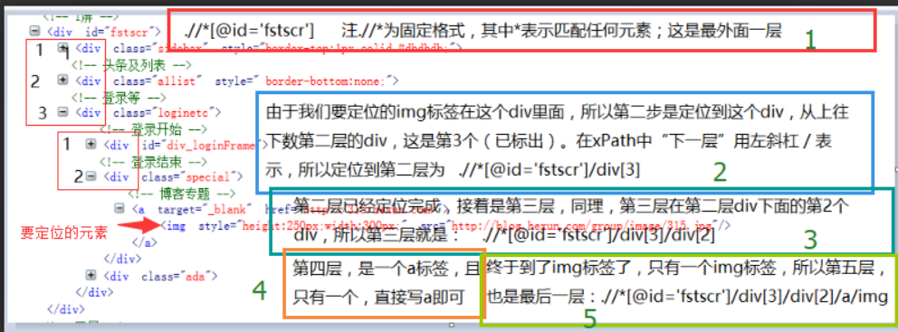
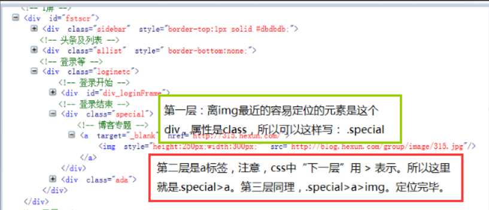

### 初始配置
1. Driver放于Python安装目录内
2. import配置
```
from selenium import webdriver
from time import sleep
from selenium.webdriver.common.keys import Keys
from selenium.webdriver.common.action_chains import ActionChains
```
3. `driver = webdriver.Chrome()`

**进入网页**  
```
driver.get("http://www.XXX.com")
```
### 等待元素
1.隐性等待（implicitly_wait()）: 随着ajax技术的广泛应用，页面的元素往往都可以时间局部加载，也就是在整个页面没有加载完的时候，可能我们需要的元素已经加载完成了。另外它是全局性的，在开头设置过之后，整个的程序运行过程中都会有效
```
driver.implicitly_wait(20)
```
2.显性等待
```
from selenium.webdriver.support.wait import WebDriverWait
from selenium.webdriver.support import expected_conditions as EC
from selenium.webdriver.common.by import By
・・・
WebDriverWait(driver,20,0.5).until(EC.presence_of_element_located((By.LINK_TEXT, 'CSDN')))
```
3.强行等待（单位秒）
`Thread.sleep(2000);`  
### 元素定位
<table><thead><tr><th>方法Method</th>
	<th>描述Description</th>
	<th>参数Argument</th>
	<th>示例Example</th>
</tr></thead><tbody><tr><td><code>id</code></td>
	<td>该方法通过ID的属性值去定位查找单个元素</td>
	<td>id: 需要被查找的元素的ID</td>
	<td><code>find_element_by_id('search')</code></td>
</tr><tr><td><code>name</code></td>
	<td>该方法通过name的属性值去定位查找单个元素</td>
	<td>name: 需要被查找的元素的名称</td>
	<td><code>find_element_by_name('q')</code></td>
</tr><tr><td><code>class name</code></td>
	<td>该方法通过class的名称值去定位查找单个元素</td>
	<td>class_name: 需要被查找的元素的类名</td>
	<td><code>find_element_by_class_name('input-text')</code></td>
</tr><tr><td><code>tag_name</code></td>
	<td>该方法通过tag的名称值去定位查找单个元素</td>
	<td>tag: 需要被查找的元素的标签名称</td>
	<td><code>find_element_by_tag_name('input')</code></td>
</tr><tr><td><code>link_text</code></td>
	<td>该方法通过链接文字去定位查找单个元素</td>
	<td>link_text: 需要被查找的元素的链接文字</td>
	<td><code>find_element_by_link_text('Log In')</code></td>
</tr><tr><td><code>partial_link_text</code></td>
	<td>该方法通过部分链接文字去定位查找单个元素</td>
	<td>link_text: 需要被查找的元素的部分链接文字</td>
	<td><code>find_element_by_partial_link_text('Long')</code></td>
</tr><tr><td><code>xpath</code></td>
	<td>该方法通过XPath的值去定位查找单个元素</td>
	<td>xpath: 需要被查找的元素的xpath</td>
	<td><code>find_element_by_xpath('//*[@id="xx"]/a')</code></td>
</tr><tr><td><code>css_selector</code></td>
	<td>该方法通过CSS选择器去定位查找单个元素</td>
	<td>css_selector: 需要被查找的元素的ID</td>
	<td><code>find_element_by_css_selector('#search')</code></td>
</tr></tbody></table>
```
# .click()
# .clear()
# .send_keys(Keys.ENTER)
# .send_keys(u"XXX")
# .send_keys(Keys.CONTROL, 'a')
```
**下拉框**  
```
driver.find_element_by_xpath("//option[.='内容']").click()
```
**页面内部frame重置及进入**
```
element_frame = driver.find_element_by_css_selector('#iframe-1')
driver.switch_to.frame(element_frame)
……
driver.switch_to.default_content()
```
**数组选择操作**
```
grou = driver.find_elements_by_class_name("mnav")
len(grou)
driver.find_elements_by_class_name("mnav")[0].click()
```
**xpath**  
  
**cssSelector** 
1. 点击一个 <a id="customer_chosen">
2. 自动产生了一个 &lt;ul id="customer_list">
3. 点击&lt;ul>的第五个&lt;li>
```
driver.find_element_by_css_selector('#customer_chosen').click()
driver.find_element_by_css_selector('#customer_list > li:nth-child(5)')
```

### 窗口操作    
**大小设定** 
```
driver.set_window_size(800, 400)
driver.maximize_window()
```
**前进后退**
```
driver.back()
driver.forward()
```

**弹出页面捕获**
```
```
**弹出框**
```
alert = driver.switch_to.alert
alert.accept()
alert.dismiss() 
```
### 鼠标键盘操作
```
context_click() # 右击
double_click() # 双击
drag_and_drop() # 拖拽
move_to_element() # 鼠标停在一个元素上
click_and_hold() # 按下鼠标左键在一个元素上
```
**Robot操作** 准确模拟鼠标键盘操作
```

```
**Action点击：** 模拟鼠标，IE不支持
```
# 方法模拟鼠标右键
from selenium.webdriver.common.action_chains import ActionChains
# 定位到要右击的元素
right =driver.find_element_by_xpath("xx")
# 对定位到的元素执行鼠标右键操作
ActionChains(driver).context_click(right).perform()
# 定位到要双击的元素
double = driver.find_element_by_xpath("xxx")
# 对定位到的元素执行鼠标双击操作
ActionChains(driver).double_click(double).perform()
```
**键盘事件**
        <table><thead><tr><th>代码</th>
			<th>描述</th>
		</tr></thead><tbody><tr><td><code>send_keys(Keys.BACKSPACE)</code></td>
			<td>删除键(BackSpace)</td>
		</tr><tr><td><code>send_keys(Keys.SPACE)</code></td>
			<td>空格键(Space)</td>
		</tr><tr><td><code>send_keys(Keys.TAB)</code></td>
			<td>制表键(Tab)</td>
		</tr><tr><td><code>send_keys(Keys.ESCAPE)</code></td>
			<td>回退键(Esc)</td>
		</tr><tr><td><code>send_keys(Keys.ENTER)</code></td>
			<td>回车键(Enter)</td>
		</tr><tr><td><code>send_keys(Keys.CONTROL,'a')</code></td>
			<td>全选（Ctrl+A）</td>
		</tr><tr><td><code>send_keys(Keys.CONTROL,'c')</code></td>
			<td>复制（Ctrl+C）</td>
		</tr></tbody></table>
```
```
### 其他
**关闭Chrome自动化测试提示**
```
options.add_experimental_option('prefs', prefs)
options.add_argument("disable-infobars")
```
**截图操作**
```
save_screenshot(file)
```
**expected_conditions模块**
```
selenium.webdriver.support.expected_conditions
```
1. 验证title: 是否等于或包含于driver.title 
```
title_is  
title_contains  
```
2. 验证元素是否出现: 传入的参数都是元组类型的locator
```
presence_of_element_located  
presence_of_all_elements_located  
```
3. 验证元素是否可见
```
visibility_of_element_located  # 传入元组类型的locator
invisibility_of_element_located  # 传入元组类型的locator
visibility_of  # 传入WebElement
```
4. 某段文本是否出现在某元素
```
text_to_be_present_in_element  
text_to_be_present_in_element_value
```
5. 判断frame是否可切入
```
frame_to_be_available_and_switch_to_it 
```
6. 判断是否有alert出现
```
alert_is_present 
```
7. 判断元素是否可点击
```
element_to_be_clickable  # 传入元组类型的locator
```
8. 判断元素是否被选中
```
element_to_be_selected  # 传入WebElement对象
element_located_to_be_selected  # locator元组
element_selection_state_to_be  # 传入WebElement对象以及状态(返回boolean)
element_located_selection_state_to_be  # 传入locator以及状态(返回boolean)
```
9. 判断一个元素是否仍在DOM中: 传入WebElement对象，可以判断页面是否刷新了
```
staleness_of 
```